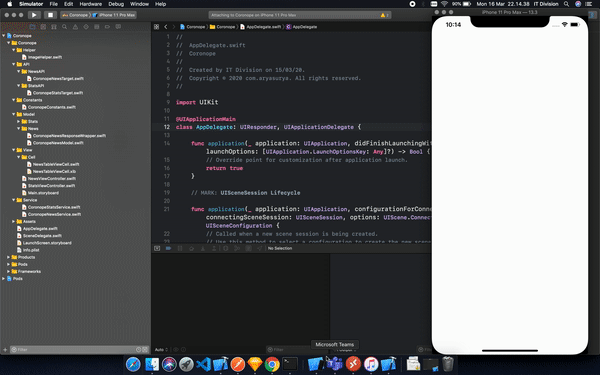

# Coronope ( Corona? Just Nope. ) 🙅🙅
Coronope is an iOS based application that display current nCoV cases statistics, Local ( Indonesia ) and Globally, and news related to the outbreak 

## Corona Virus Tracker and News
+ consist of live data of confirmed, recovered, and deaths cases of nCoV in Indonesia which updated every half an hour
+ consist of list of news about the current outbreak

## Architecture
+ Model : Model for Data Container and Response Wrapper from JSON
+ View : Literally the View used, consisting of cells of table view and View Controllers
+ Service : The Main Logic of the Application, consisting of network parsing ( could be refactored more in the future ), and data flow logic
+ API : The End Point Target used to fetch the data

## Contributing
Pull requests are welcome. :D

## Demo

## Credit
- github.com/alfianlosari for the nCoV API 

## License

MIT License
Copyright © 2020 Coronope

Permission is hereby granted, free of charge, to any person obtaining a copy of this software and associated documentation files (the “Software”), to deal in the Software without restriction, including without limitation the rights to use, copy, modify, merge, publish, distribute, sublicense, and/or sell copies of the Software, and to permit persons to whom the Software is furnished to do so, subject to the following conditions:

The above copyright notice and this permission notice shall be included in all copies or substantial portions of the Software.

THE SOFTWARE IS PROVIDED "AS IS", WITHOUT WARRANTY OF ANY KIND, EXPRESS OR IMPLIED, INCLUDING BUT NOT LIMITED TO THE WARRANTIES OF MERCHANTABILITY, FITNESS FOR A PARTICULAR PURPOSE AND NONINFRINGEMENT. IN NO EVENT SHALL THE AUTHORS OR COPYRIGHT HOLDERS BE LIABLE FOR ANY CLAIM, DAMAGES OR OTHER LIABILITY, WHETHER IN AN ACTION OF CONTRACT, TORT OR OTHERWISE, ARISING FROM, OUT OF OR IN CONNECTION WITH THE SOFTWARE OR THE USE OR OTHER DEALINGS IN THE SOFTWARE.
